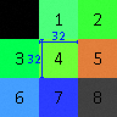

# Basic-Terrain-Generator
**Procedural generation of 2D terrain.**

## Overview
<p>&nbsp;&nbsp;&nbsp;&nbsp;
I started this project with pulling inspiration from a couple of modern 
games.  Minecraft, with its extremely fine-tuned and robust terrain 
generation in 3-dimensional space, is usually regarded as the project that 
sparked the sandbox indie genre.  Using a program called Amidst, the terrain 
can be seen on a larger scale showing just how amazing this process can be; 
just from one single seed.  The other game is Factorio, a game focusing on 
crafting and supply-demand factory development.  The in-game world generator 
takes a single seed as well, turning a blank slate into a unique world with 
scattered ore deposits, lakes, and forests (not to mention enemies).  Most if 
not all games today feature some amount random number generation, whether it 
be implemented in terrain, item properties, or even the splash screen.  The 
inclusion of such features gives the user a sense that the world is more 
natural and dynamic making the experience personal and enriched.
</p>

<p>&nbsp;&nbsp;&nbsp;&nbsp;
For this project, we’re going to be looking solely at generating tile-based 
terrain and experimenting with trying to make the terrain look a bit more 
like a finished product.  I decided to use GameMaker: Studio 1.4 as my tool 
of choice.  GameMaker will take care of the many back-end tasks so I can 
focus on the concept.  The downside to using GameMaker’s language (GML) is 
that speed and optimization can’t be improved significantly because of how 
strict GML’s data handling rules are.  For the sake of simplicity of the 
project, this is simply a proof of concept project.  Moving further along, 
ideally I would build this in a language like C++ along with SFML.
</p>

<p>&nbsp;&nbsp;&nbsp;&nbsp;
  Terrain generation at the basic level will consist of biome creation and data 
representation.  Biomes will be given a certain distinct color and placement 
will be determined by an algorithm.  The structuring of data will be set up 
so editing of tiles is relatively simple.  This means terrain should also be 
easily loaded and saved from storage.
</p>

---
## Data Structure

  The first problem is building the foundation for all the data that will be
generated.  This data structure has three layers utilizing two custom
'classes'(I say classes, but in GameMaker they're simply ds_grids). Each
layer can be represented on a 2D grid/plane using a coordinate system.
Each layer 'space'(in the mathematical sense) has similar properties and rules.

### Tile Space

  The lowest level of the data structure is the tiles.  Each tile is
represented as a 32 pixel by 32 pixel square on the screen at 1x scale/zoom.
A tile in code is an ID, an integer, which corresponds to a texture in some tile set.



*Tile Set with nine unique tiles*

### Subregion Space

  A subregion is a square grid container for tiles.  Subregions have their own coordinate
system illustrated in the picture below.  The coordinates in black represent the tile
location relative to the parent subregion's origin.  The blue coordinates represent the
tile location in tile space.


*Center should say Subregion(-1, 0)*

### Region Space

  A region is a square grid container for subregions.  Regions have their own coordinate
system illustrated in the picture below.  The coordinates in black represent the region
location in region space relative to the origin.  The measurements in blue indicate that
each region spans 256 by 256 in tile space, also meaning each region holds 16 by 16 (or 256)
subregions.


### Loading and Saving Formats

  The loading and saving function isn't currently used, but I can at least go over how the
format would work.  Each file would represent one region named in the following way:
```
x.y.r
```
Where "x" is the region space x coordinate, y is the region space y coordinate, and "r" is
the file extension.  Each line in the file represents one subregion, meaning at most the file
will havve 256 lines.  Finally, each line holds the respective subregion's tile IDs, meaning
at most the line holds 256 values.  Parsing always starts from the upper left of whatever
container is being saved/loaded and proceeds to parse in row order (kind of like reading a book).

---
## Terrain/Biome Rules

### Algorithm

### Implementation

---
## Perlin Noise

### Algorithm

### Implementation


---
## Fractal Noise

### Algorithm

### Implementation


---
## Conclusion

### Final Product
